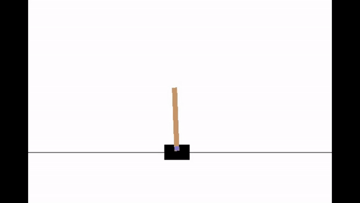

# Advantage Actor Critic Implementation



An implementation of the advantage actor critic algorithm to solve reinforcement learning problems. 

The algorithm uses a two-headed neural network, with one head computing the agent's policy and the other estimating the value of the given state. 

It is an online algorithm, using its current policy at each training step to collect a small batch of experience and use it to optimize the neural network parameters. The policy gradient and value function loss are calculated according to the formulas below:

  .


The code can be run by calling the following command with Python 3 and PyTorch installed:

```bash
python evaluate.py
```

